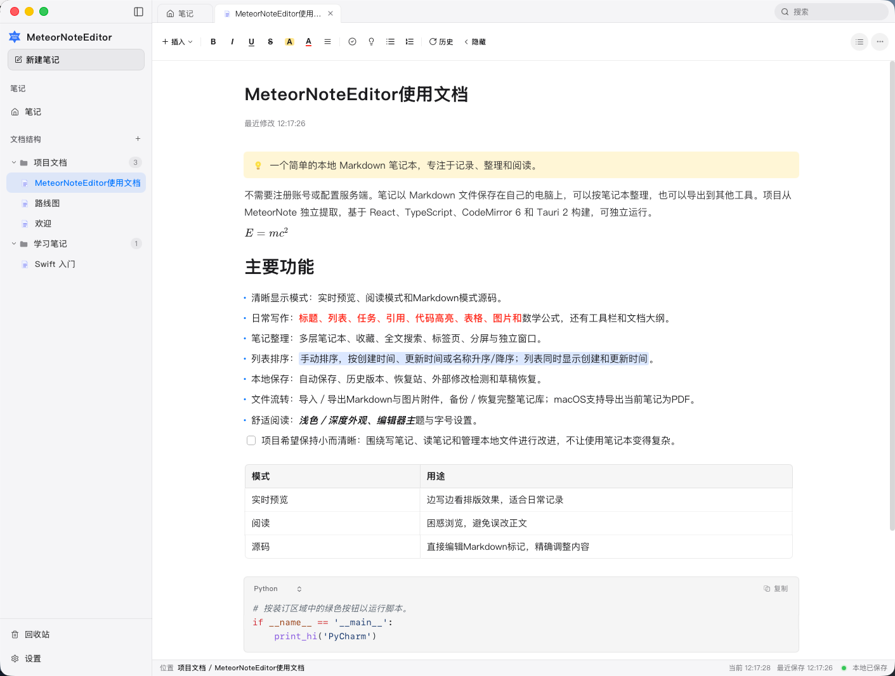

# MeteorNoteEditor

[English](README.md) | **简体中文**

**少一点花哨，多一点清爽。打开就写，笔记留在自己手里。**

受够了笔记软件里用不上的花哨功能，又舍不得飞书文档那种清爽的排版？MeteorNoteEditor 就从这个想法出发：做一个简单的本地 Markdown 笔记本，让日常记录写得顺手、看得舒服。

打开一篇笔记就能开始写。习惯 Markdown，就直接输入；想少记语法，就用工具栏。文件保存在自己的电脑上，需要时可以导出到其他工具，不需要注册账号或配置服务端。

<!-- 应用截图：将主界面截图保存为 docs/screenshots/overview.png，
再把下面这行图片引用移到注释外。中英文 README 共用同一张图片。

其他截图的命名与添加方式见 docs/screenshots/README.md。
-->

## 为什么做这个笔记本

我想要的是一个能安心写东西的地方：正文清楚，排版舒服，常用格式顺手。喜欢飞书文档的清爽阅读与编辑体验，也希望用本地 Markdown 文件保存自己的记录。

所以，这个项目会持续打磨写作、阅读和文件保存。文字能准确选中、行距保持一致、表格好编辑、内容可靠保存，这些日常细节比再加一层功能更值得花时间。

## 它能做什么

- **清爽地写**：标题、列表、待办、引用、代码高亮、表格、图片和公式，支持工具栏操作，也支持直接输入 Markdown。
- **舒服地看**：实时预览、只读阅读和源码三种模式；支持浅色／深色外观、编辑器主题与字号调整。
- **方便地找**：笔记本、收藏与全文搜索；按创建时间、更新时间或名称正反排序，也可以保留手动顺序。需要对照资料时，可使用标签页、分屏或独立窗口。
- **保存在本地**：笔记以 Markdown 文件保存，配有自动保存、历史版本、回收站、外部修改检测和草稿恢复。
- **随时带走**：导入／导出 Markdown 与图片附件，备份／恢复完整笔记库；macOS 支持将当前笔记导出为 PDF。

## 显示模式

| 模式 | 用途 |
| --- | --- |
| 实时预览 | 边写边看排版效果，适合日常记录 |
| 阅读 | 只读浏览，避免误改正文 |
| 源码 | 直接编辑 Markdown 标记，便于精确调整内容 |

在笔记右上角的“更多”菜单中切换。支持常见 Markdown 内容；合并表格、图片裁剪、颜色和对齐等扩展在其他编辑器中可能显示不同，详见 [使用指南](docs/USER_GUIDE.md)。

应用界面目前为简体中文。笔记正文可以使用英文、中文或中英混排；README 的语言不影响应用界面语言。

## 平台状态

当前项目版本为 `0.1.0`，仍在完善中。

| 平台 | 当前状态 |
| --- | --- |
| macOS | 已进行本地开发与构建验证；构建配置要求 macOS 12.0 及以上，未逐一验证所有系统版本 |
| Windows | 已加入兼容性处理、NSIS 安装包配置和构建工作流；尚未完成 Windows 实机验收 |
| Linux | 尚未验证，未提供专用打包配置 |

直接导出 PDF 目前仅支持 macOS。Windows 工作流的存在不代表构建已经通过；已执行的检查与限制见 [验证记录](docs/VERIFICATION.md)。

## 从源码运行

需要 **Node.js 20**、npm、Rust stable，以及对应平台的 Tauri 开发依赖：

- macOS：Xcode Command Line Tools。
- Windows：Visual Studio Build Tools 的“使用 C++ 的桌面开发”工作负载、Windows SDK、WebView2 Runtime，以及 Rust MSVC 工具链。

完整的平台准备步骤见 [Tauri 开发环境说明](https://v2.tauri.app/start/prerequisites/)。首次安装依赖需要网络。

```sh
git clone https://github.com/GowareT/MeteorNoteEditor.git
cd MeteorNoteEditor
npm ci
npm run tauri:dev
```

这会打开桌面应用，并在修改代码后自动更新。使用 nvm 的开发者可先运行 `nvm use`，仓库已提供 `.nvmrc`。

`npm run dev` 仅启动端口为 `5183` 的前端开发服务，不能作为完整的网页版笔记本使用；笔记文件读写依赖 Tauri 桌面环境。

打包当前平台的应用：

```sh
npm run tauri:build
```

产物位于 `src-tauri/target/release/bundle/`。平台依赖、测试和发布准备见 [开发指南](docs/DEVELOPMENT.md)。

项目从 MeteorNote 独立提取，可独立运行，基于 React、TypeScript、CodeMirror 6 和 Tauri 2 构建。

## 笔记保存在哪里

| 平台 | 默认笔记目录 |
| --- | --- |
| macOS | `~/Library/Application Support/MeteorNoteEditor/Notebooks` |
| Windows | `%APPDATA%\MeteorNoteEditor\Notebooks` |

每篇笔记以独立目录保存，包含 Markdown 正文、图片附件和历史版本。回收站位于 `Notebooks` 同级的 `Trash` 目录。设置中可打开本地存储位置。

**迁移到其他 Markdown 工具**可使用 Markdown 导出；**保存完整笔记库**请使用 `.mnebackup` 备份，包含附件、历史版本和回收站。备份不包含外观偏好，且未加密。具体范围与恢复方式见 [数据管理说明](docs/USER_GUIDE.md#导入导出与备份)。

## 文档与参与

- [使用指南](docs/USER_GUIDE.md)：编辑、排序、保存、导入导出与常见问题。
- [开发指南](docs/DEVELOPMENT.md)：环境准备、项目结构、测试与打包。
- [贡献指南](CONTRIBUTING.md)：报告问题、讨论改进与提交代码。
- [截图添加说明](docs/screenshots/README.md)：应用效果图的存放位置、命名和 README 展示方式。
- [更新记录](CHANGELOG.md)：尚未发布的变更。
- [安全说明](SECURITY.md)：数据边界与漏洞反馈。

遇到问题可以 [提交 Issue](https://github.com/GowareT/MeteorNoteEditor/issues)，请附上系统版本、复现步骤和不含隐私的最小示例。

## 许可证

项目采用 [MIT 许可证](LICENSE)。第三方依赖和素材遵循各自的许可证，详见 [第三方声明](THIRD_PARTY_NOTICES.md)。
