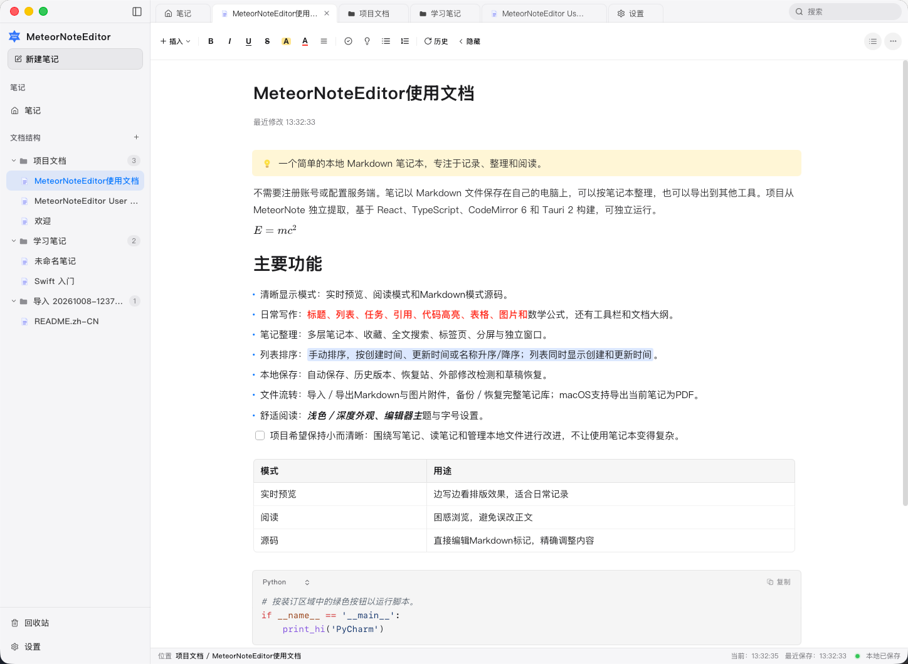

# 应用截图 / App screenshots

[中文项目说明](../../README.zh-CN.md) · [English README](../../README.md)

应用效果截图统一放在这个目录：`docs/screenshots/`。它们是项目介绍用的图片，随仓库一起提交；应用图标仍放在原来的 `public/` 和 `src-tauri/icons/` 中。

主界面截图按语言分别展示：英文 README 使用 `overview.png`，中文 README 使用 `overview_zh.png`。更新时替换对应的同名文件即可。



## 文件命名与展示内容

优先放一张能体现清爽排版的主界面图。其他图片按需添加，不必为了覆盖功能而把首页变成截图合集。

| 文件名 | 建议内容 |
| --- | --- |
| `overview.png` | 英文主图：英文界面的完整应用窗口，用于英文 README |
| `overview_zh.png` | 中文主图：中文界面的完整应用窗口，用于中文 README |
| `editing.png` | 可选：正文、标题、列表、表格等常用格式，展示编辑效果 |
| `dark-mode.png` | 可选：同一篇笔记的深色外观，便于对比 |
| `source-mode.png` | 可选：同一篇笔记的 Markdown 源码模式 |

主图可以使用一篇虚构的“周末阅读笔记”或“项目小记”：一小段正文、几个列表项和一张简洁的表格即可。保留适当留白，让读者先看清写作界面和文字排版。

## 添加到首页

1. 在真实应用中截图。macOS 可按 `⌘ ⇧ 4`，再按空格，选择应用窗口。
2. 英文界面截图命名为 `overview.png`，中文界面截图命名为 `overview_zh.png`，放入当前目录。其他截图使用上表中的名称。
3. 两份根目录 README 已分别引用对应语言的主图，替换同名图片不需要修改引用。添加其他截图或更改文件名时，更新对应 README 的图片路径；图片引用应放在 `<!-- ... -->` 注释外。
4. 预览两份 Markdown，确认图片正常显示，再一起提交图片和文档。

中文 README 的引用：

```md

```

英文 README 的引用：

```md

```

这些路径相对于仓库根目录的 README；其他目录中的文档引用时需调整相对路径。请保留中英文主图的独立引用，避免展示错误的界面语言。

## 图片建议

- 使用当前版本的真实界面和示例内容，不使用设计稿冒充应用截图。
- 关闭无关菜单和调试面板，避免包含通知、个人笔记、账号或私人路径。
- 建议宽度约 1440–1920 像素，保证正文在 GitHub 上仍然清晰；只展示相关窗口即可。
- 静态截图优先使用 PNG，建议单张控制在 1 MB 左右。可使用 WebP，但需同步修改 README 的文件名和扩展名。
- 不需要用大 GIF 展示静态界面；只在说明具体交互时使用短动画。

## English quick guide

Store application screenshots in `docs/screenshots/`. Use `overview.png` for the English interface and `overview_zh.png` for the Chinese interface. Capture a real application window with a simple sample note that shows the clean writing layout. Optional images are `editing.png`, `dark-mode.png`, and `source-mode.png`.

The English README displays `overview.png`; `README.zh-CN.md` displays `overview_zh.png`. Replace the corresponding file to update each main image. For additional screenshots or filename changes, update the relevant README, keep image references outside HTML comments, and check both previews.

Use sample content without personal information. Aim for a readable 1440–1920 px image and roughly 1 MB per screenshot. Prefer PNG for text-heavy screenshots; if you use WebP, update the references accordingly.
